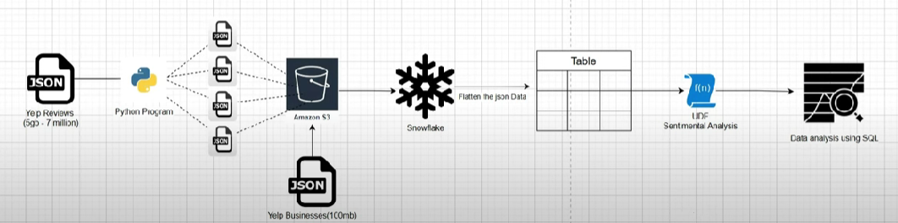

# Yelp Reviews Sentiment Analysis and Business Insights with Snowflake

## Project Overview

This project focuses on analyzing Yelp review data to extract business insights and perform sentiment analysis. The architecture leverages Snowflake for data warehousing, an Amazon S3 bucket for data staging, and Python for data splitting and custom User-Defined Functions (UDFs). The primary goal is to demonstrate a robust data pipeline, from raw JSON ingestion to advanced SQL-based analysis and sentiment classification.

## Project Flow Diagram

The following diagram illustrates the end-to-end data pipeline:



## Data Sources

The core data for this project comes from the [Yelp Open Dataset](https://www.yelp.com/dataset). Specifically, two main datasets are used:

* **Yelp Reviews**: A large dataset (approximately 5GB, 7 million reviews) containing review text, stars, user IDs, and business IDs.
* **Yelp Businesses**: A smaller dataset (approximately 100MB) with business details such as name, categories, city, state, and review counts.

## Architecture and Technologies

* **Data Ingestion**:
    * **Python Script (`split_files.py`)**: Due to the large size of the Yelp Reviews JSON file (5GB), a Python script is used to split it into multiple smaller JSON files. This facilitates easier handling and upload to S3.
    * **Amazon S3**: Acts as a staging area for both the split Yelp Review JSON files and the Yelp Business JSON file before being loaded into Snowflake.
* **Data Warehousing & Transformation**:
    * **Snowflake**: The cloud data platform used for data warehousing. It's responsible for:
        * Ingesting JSON data from S3.
        * Flattening semi-structured JSON into a relational table format.
        * Hosting a Python User-Defined Function (UDF) for sentiment analysis.
* **Sentiment Analysis**:
    * **Python UDF in Snowflake (`analyze_sentiment`)**: A Python function embedded within Snowflake using the `textblob` library to determine the sentiment (Positive, Negative, Neutral) of each review.
* **Data Analysis & Insights**:
    * **SQL Queries**: All business insights and data analysis are performed directly within Snowflake using SQL.

## Project Structure
```

├── 01_yelp_data_setup.sql          # SQL script for Snowflake table creation, S3 data loading, UDF, and JSON flattening.
├── 02_business_analysis.sql        # SQL script containing various business intelligence queries.
├── split_files.py                  # Python script to split the large Yelp Reviews JSON file.
├── project_flow_chart_process.png  # Visual representation of the data pipeline.
├── requirements.txt                # Python dependencies for the project.
└── README.md                       # This README file.

```
## Setup and Running the Project

Follow these steps to set up and run the project:

### 1. Download Yelp Dataset

1.  Go to the [Yelp Open Dataset](https://www.yelp.com/dataset) page.
2.  Download the `yelp_academic_dataset_review.json` (approx. 5GB) and `yelp_academic_dataset_business.json` (approx. 100MB) files.
3.  Place both files in a directory on your local machine, for example, `C:\Users\YADAV\Desktop\Yelp_project\`.

### 2. Prepare Yelp Reviews Data

The `yelp_academic_dataset_review.json` file is very large. To handle it efficiently, we'll split it into smaller parts.

1.  **Update `split_files.py`**: Open `split_files.py` and ensure the `input_file` and `desktop_path` variables correctly point to your downloaded review file and desired output directory.
    ```python
    input_file = r"C:\Users\YADAV\Desktop\Yelp_project\yelp_academic_dataset_review.json"  # Your 5GB JSON file
    desktop_path = r"C:\Users\YADAV\Desktop"  # Path to Desktop or your desired output folder
    output_prefix = os.path.join(desktop_path, "split_file_") # Prefix for output files
    num_files = 10 # Number of files to split into (adjust as needed)
    ```
2.  **Run the Python Script**: Execute `split_files.py` from your terminal:
    ```bash
    python split_files.py
    ```
    This will generate `split_file_1.json`, `split_file_2.json`, ..., `split_file_10.json` (or however many you specified) on your Desktop (or the specified `desktop_path`).

### 3. Upload Data to Amazon S3

1.  **Create an S3 Bucket**: Log in to your AWS Management Console and create a new S3 bucket (e.g., `yelp-json-project`) in your preferred region.
2.  **Upload Files**:
    * Upload all the `split_file_*.json` files (generated by `split_files.py`) into the root of your S3 bucket.
    * Upload `yelp_academic_dataset_business.json` into the root of the same S3 bucket.

### 4. Configure Snowflake

1.  **Create Snowflake Account**: If you don't have one, sign up for a Snowflake account.
2.  **Get AWS Credentials**: You'll need your AWS Access Key ID and Secret Access Key to allow Snowflake to access your S3 bucket. **Replace the placeholder credentials in `01_yelp_data_setup.sql` with your actual AWS credentials.**
    ```sql
    CREDENTIALS = (
        AWS_KEY_ID = 'YOUR_AWS_ACCESS_KEY_ID'
        AWS_SECRET_KEY = 'YOUR_AWS_SECRET_ACCESS_KEY'
    )
    ```
    **Security Note**: For production environments, consider using Snowflake's [Storage Integrations](https://docs.snowflake.com/en/user-guide/data-load-s3-config.html) for more secure access without hardcoding credentials.

### 5. Run Snowflake SQL Scripts

Execute the following SQL scripts in your Snowflake worksheet in the specified order:

#### a. `01_yelp_data_setup.sql`

This script sets up the necessary tables, copies data from S3, and defines the sentiment analysis UDF.

* **Step 1: Create Raw Tables**: `yelp_reviews` and `yelp_business` tables are created to hold the raw JSON data.
* **Step 2: Copy Data from S3**: Data from your S3 bucket is copied into these raw tables. Make sure your `AWS_KEY_ID` and `AWS_SECRET_KEY` are correctly configured.
* **Step 3: User Defined Function (UDF) for Sentiment Analysis**: A Python UDF named `analyze_sentiment` is created. This UDF uses the `TextBlob` library to classify review text into 'Positive', 'Negative', or 'Neutral' sentiment.
    * **Note**: Snowflake automatically manages the `textblob` package dependency because it's specified in `PACKAGES = ('textblob')`.
* **Step 4: Flatten JSON into Tabular Structures**: The raw JSON data is transformed and flattened into `table_yelp_reviews` and `table_yelp_business` for easier querying. The `sentiment` column is added to `table_yelp_reviews` by calling the `analyze_sentiment` UDF.

#### b. `02_business_analysis.sql`

This script contains various pre-defined SQL queries to extract valuable business insights from the flattened Yelp data. You can run these queries individually or all at once to explore the data.

**Example Queries Included:**

1.  Find the number of businesses in each category.
2.  Find the top 10 users who reviewed the most restaurants.
3.  Identify the most popular categories by the number of reviews.
4.  Retrieve the top 3 most recent reviews for each business.
5.  Determine the month with the highest number of reviews.
6.  Calculate the percentage of 5-star reviews for each business.
7.  Find the top 5 most reviewed businesses in each city.
8.  Calculate the average rating of businesses with at least 100 reviews.
9.  List the top 10 users with the most reviews and the businesses they reviewed.
10. Identify the top 10 businesses with the highest positive sentiment reviews.

## Future Enhancements

* **Data Quality Checks**: Implement checks for data completeness and consistency during ingestion.
* **Scheduled Data Refresh**: Set up automated data loads using Snowflake tasks or external orchestrators.
* **Dashboarding**: Integrate with BI tools like Tableau, Power BI, or Looker to create interactive dashboards for insights.
* **More Advanced Sentiment Analysis**: Explore more sophisticated NLP models for sentiment analysis, potentially integrating with external APIs if cost-effective.
* **Machine Learning**: Use the dataset for predictive modeling, such as predicting business success based on reviews or identifying review helpfulness.

## Contributing

Feel free to fork this repository, submit pull requests, or open issues if you have suggestions or find bugs.

